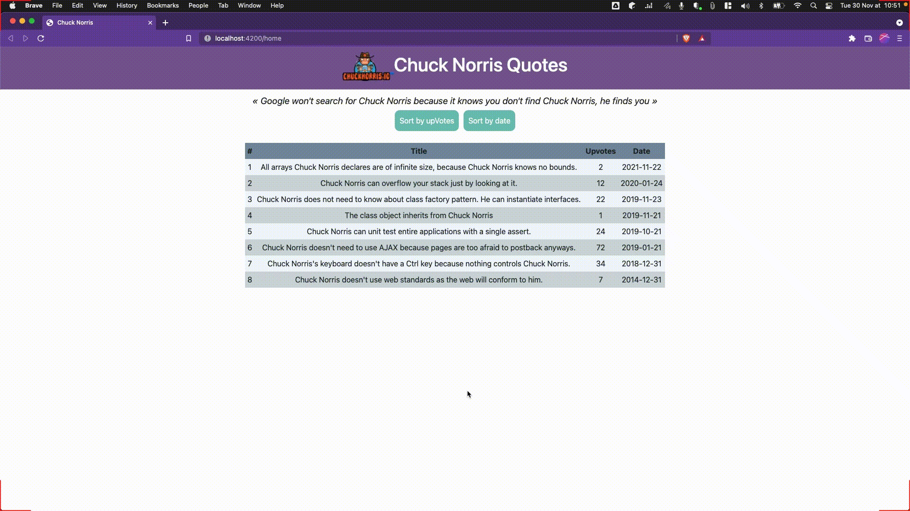

# Lavanda Angular Challenge

This is the design we need to achieve:

- The app has two component named `home` and `quotes`. The list of quotes to be displayed is already provided in the app.
- The list of quotes is accessible through the `QuoteService`, it returns an observable to simulate an HTTP call
- Each quote has the following four properties:
  - `id`: id of the quote [string]
  - `quote`: The quote itself [string]
  - `upVotes`: The number of upVotes for a quote [number]
  - `date`: The publish date for the quote in the format YYYY-MM-DD [string]

##The app must have the following functionalities:

- By default, the quotes should be displayed in the table ordered by the number of upVotes in descending order.
- Clicking on the "Sort by Upvotes" button should reorder and display the quotes by the number of upvotes in descending order.
- Clicking on the "Sort by Date" button should reorder and display the quotes by date in descending order.
- The app should look like the design provided above.
- Write a unit test to test that the sort buttons are working

Your task is to complete the implementation of `home` and `quotes` component.
